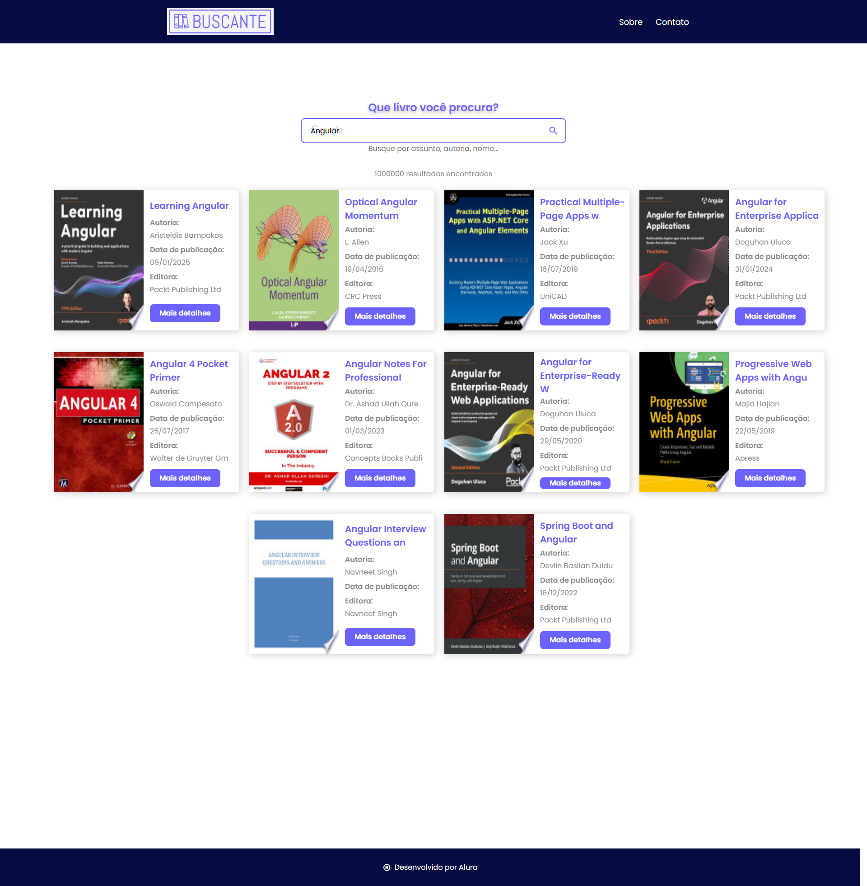
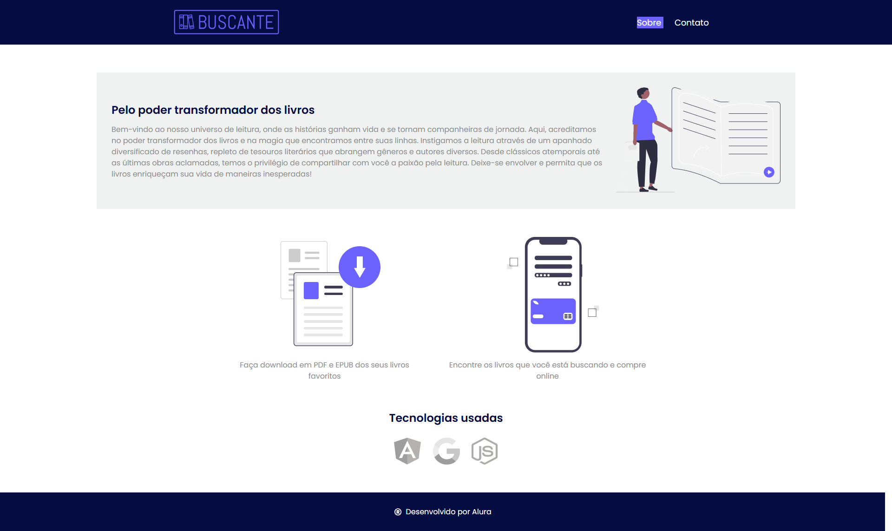
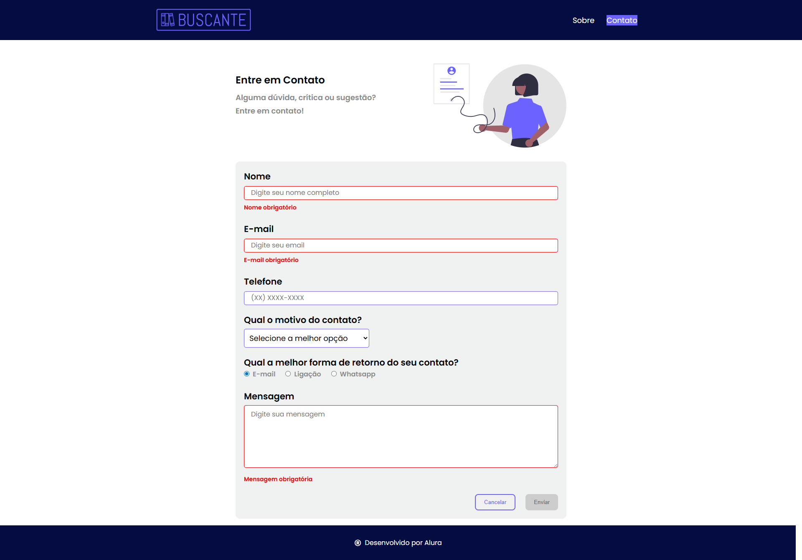

# ♿ Buscante Acessibilidade - Angular

Aplicação **Buscante** mais inclusiva, aplicando práticas de **Acessibilidade Web (A11Y)** com **Angular 19**, melhorando a experiência de navegação para todos os usuários.

---

## 🧠 O que aprendemos

Durante o curso, foram aplicadas técnicas de **Acessibilidade Avançada** no Angular, incluindo:

- ✳️ Adicionar acessibilidade no projeto **Buscante**;  
- 🧭 Ajustar **roteamento**, **formulários** e **modais** com foco em acessibilidade;  
- 🔊 Fornecer **feedback auditivo** através de mensagens dinâmicas e leitores de tela;  
- 🏷️ Inserção de **atributos ARIA** para tornar os componentes compreensíveis por tecnologias assistivas.

---

## 🧩 Tecnologias utilizadas

| Tecnologia | Descrição |
|-------------|------------|
| **Angular 19** | Framework principal da aplicação |
| **TypeScript** | Linguagem base utilizada no Angular |
| **HTML5 / CSS3** | Estrutura e estilização da aplicação |
| **ARIA (Accessible Rich Internet Applications)** | Atributos para melhorar a acessibilidade |
| **Node.js 20.x** | Ambiente de execução para o Angular CLI |
| **RxJS** | Programação reativa para eventos e dados |

---

## ⚙️ Como instalar o projeto

### 🔹 Pré-requisitos

Antes de começar, verifique se você possui instalado:
- [Node.js **v20.x**](https://nodejs.org/)
- [Angular CLI **v19+**](https://angular.io/cli)
- NPM (gerenciador de pacotes do Node)

### 🔹 Passos de instalação

```bash
# Clonar o repositório
git clone https://github.com/marcionavarro/alura-angular-moderno.git

# Entrar no diretório do projeto
cd buscante-acessibilidade

# Instalar as dependências
npm install

# Rodar o servidor de desenvolvimento
ng serve

# Acessar no navegador
http://localhost:4200
```

## 🖼️ Screenshots

Abaixo está uma das telas do curso, mostrando os tópicos principais abordados:

### Tela Principal


### Tela Sobre


### Tela contato


---

🧑‍💻 Autor
Márcio Navarro  
📍 [marcionavarro](https://marcionavarro.com.br)  
Projeto desenvolvido durante os cursos da [Alura](https://www.alura.com.br/).
