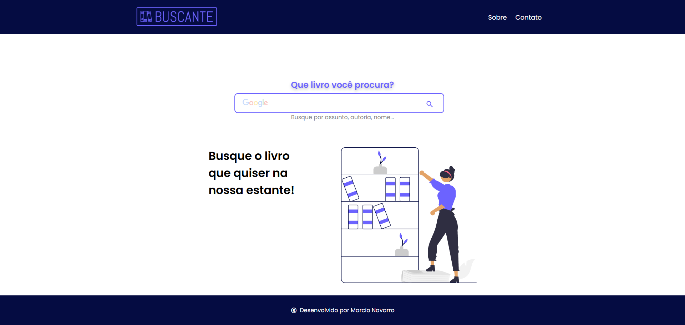
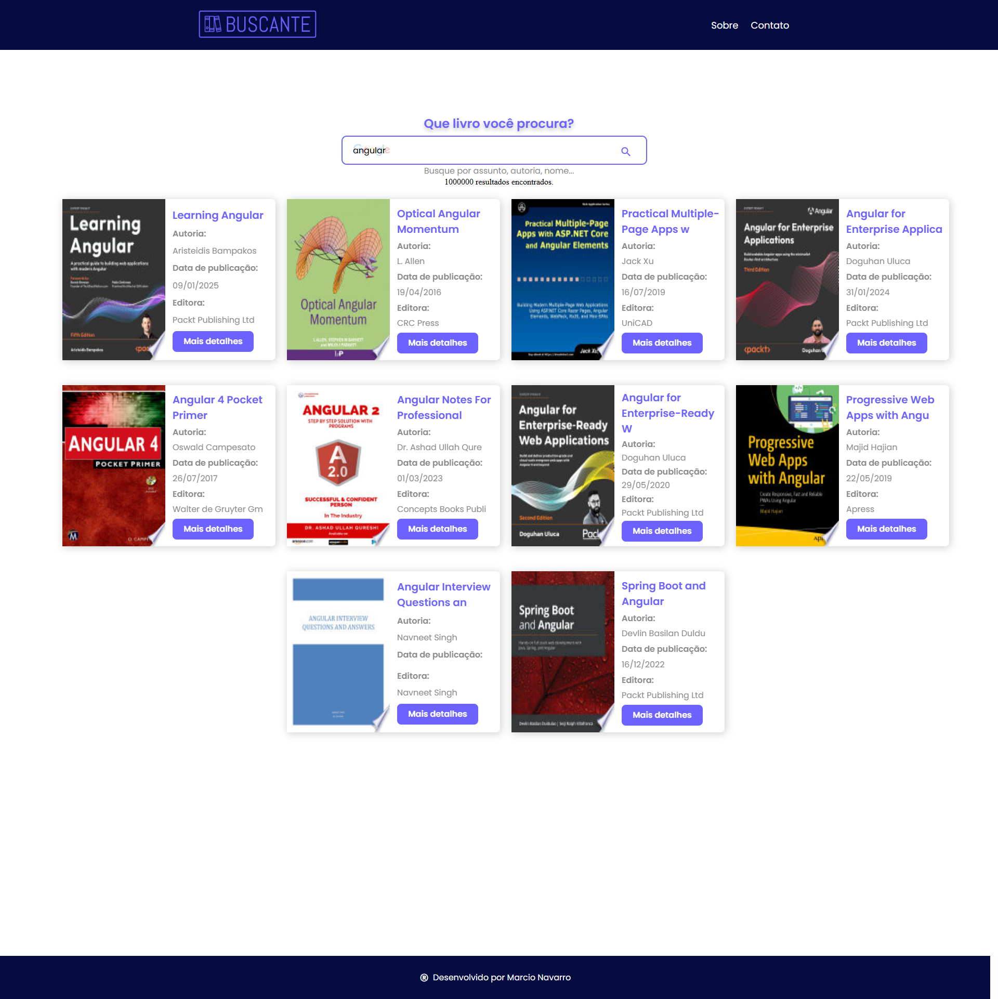

# 📚 Buscante - Projeto Angular
### Neste curso da Alura, desenvolvemos uma aplicação Angular que consome a API do Google Books de forma reativa, utilizando o RxJS para gerenciar fluxos de dados, eventos e requisições assíncronas com eficiência e elegância..
---

## 🚀 Funcionalidades


- 🔍 **Busca de livros em tempo real**  
  A aplicação se conecta à **Google Books API** e realiza buscas conforme o usuário digita, sem a necessidade de cliques adicionais.
- ⏳ **Controle de requisições**  
  Uso de operadores RxJS como `debounceTime` e `distinctUntilChanged` para evitar requisições desnecessárias e melhorar a performance.
- ⚙️ **Tratamento de erros**  
  Implementação de operadores como `catchError` para capturar falhas de rede e exibir mensagens amigáveis ao usuário.
- 🔄 **Programação reativa**  
  Através do uso de **Observables**, **Subjects** e **pipe operators**, o fluxo de dados da aplicação é totalmente reativo, reagindo automaticamente às mudanças de estado.
- 📦 **Integração com serviços Angular**  
  Toda a comunicação com a API é feita via **serviço** dedicado (`BookService`), garantindo um código limpo e desacoplado.

---  

## 🧠 Conceitos abordados

- Introdução à **programação reativa**  
- Criação e manipulação de **Observables**  
- Uso de **operadores RxJS** (`map`, `filter`, `switchMap`, `debounceTime`, `distinctUntilChanged`, `catchError`, etc.)  
- Diferença entre **Observable** e **Promise**  
- Comunicação entre componentes reativos  
- Melhoria de performance em requisições HTTP  
- Boas práticas no uso de **RxJS** com **Angular**

## ⚙️ Instalação e Execução

### 🔧 Pré-requisitos
- **Node.js** (versão 16 ou superior)
- **Angular CLI** (v14)

---

### 🖥️ Passo a passo para rodar o projeto

#### 1️⃣ Clone o repositório
```bash
git clone https://github.com/marcionavarro/alura-angular-moderno.git
cd alura-angular-moderno/buscante
````

2️⃣ Instale as dependências
```bash
npm install
````

3️⃣ Rode o servidor de desenvolvimento
```bash
npm start ou ng serve
````


## 🧩 Tecnologias utilizadas

- **Angular**  
- **RxJS**  
- **TypeScript**  
- **Google Books API**  
- **HTML5 / CSS3**

---


## 📸 Screenshots

### 🧾 Interface Principal


### 🧾 Interface de Pesquisa



## 🧑‍💻 Autor

Márcio Navarro  
📍 [github.com/marcionavarro](github.com/marcionavarro)  
Projeto desenvolvido durante os cursos da [Alura](https://www.alura.com.br/).