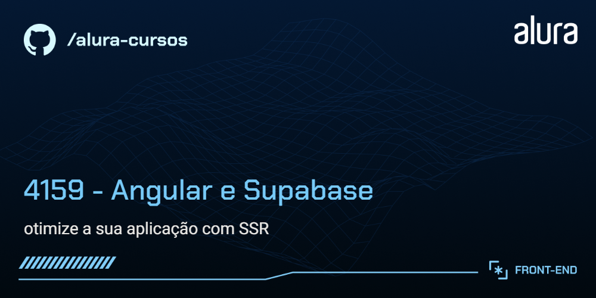
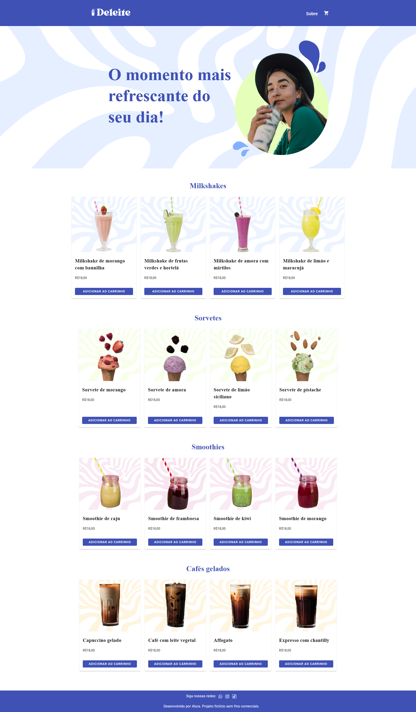
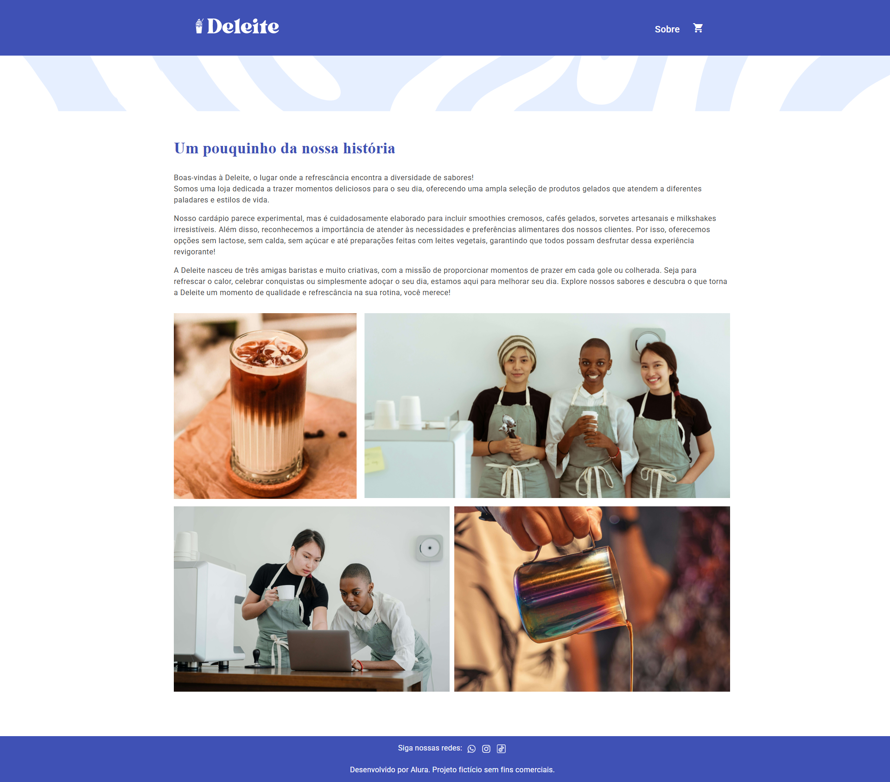
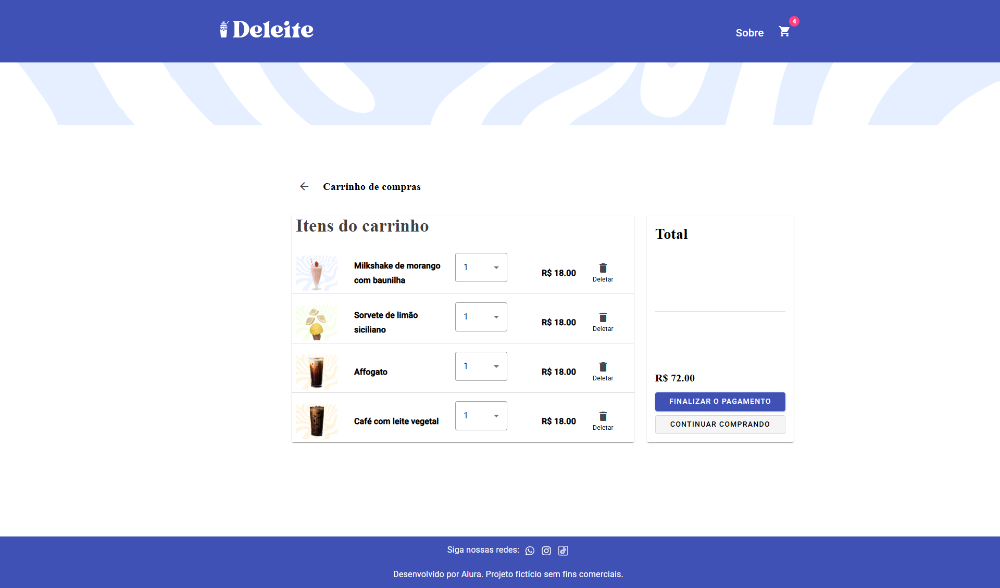



# ✨ Deleite

**Deleite** é um projeto de e-commerce criado com Angular, focado em oferecer uma experiência visual atraente, veloz e responsiva utilizando Server-Side Rendering (SSR) e pré-renderização de rotas. O aplicativo disponibiliza uma página inicial com produtos e uma página de detalhes para cada item, trazendo informações completas, imagens e preços.

## 🎯 Funcionalidades do projeto

- **Listagem de produtos**: apresenta todos os produtos disponíveis com imagem, nome e resumo.
- **Tela de detalhes do produto**: exibe informações completas do item selecionado, incluindo preço, ingredientes e descrição.
- **Navegação fluida**: páginas renderizadas no servidor garantindo carregamento rápido.
- **SEO e compartilhamento otimizados**: uso de meta tags Open Graph para melhor visualização em redes sociais.
- **Integração com backend**: consumo de dados via Supabase para carregar produtos dinamicamente.
- **Design consistente com Angular Material**: componentes estilizados que seguem um visual moderno.

## 🛠️ Técnicas e tecnologias utilizadas

| Categoria        | Ferramenta / Técnica         |
| ---------------- | ---------------------------- |
| Framework        | Angular 19                   |
| Renderização     | SSR (Server-Side Rendering)  |
| Pré-renderização | SSG (Static Site Generation) |
| Backend          | Supabase                     |
| UI               | Angular Material             |
| API              | @supabase/supabase-js        |
| Servidor         | Express                      |
| Gerenciamento    | Nx                           |
| Testes           | Karma + Jasmine              |

## 🎓 O que aprendemos neste projeto

- Como configurar e executar um app Angular com SSR.
- Como pré-renderizar rotas estáticas usando SSG.
- Como conectar um frontend Angular ao Supabase para buscar dados.
- Como usar Angular Material para construir interfaces modernas.
- Como configurar metatags Open Graph para SEO.
- Como organizar a estrutura de um projeto NX com Angular.

## 📋 Pré-requisitos e dependências

Antes de começar, certifique-se de ter instalado no seu ambiente:

- Node.js (versão 18 ou superior recomendada)
- npm
- Angular CLI
- Git

Dependências principais usadas no projeto:

- @angular/core
- @angular/platform-browser
- @angular/platform-server
- @angular/material
- @supabase/supabase-js
- @supabase/ssr
- express
- nx

## 🚀 Como clonar, instalar e rodar

```bash
# Clone o repositório
git clone https://github.com/marcionavarro/alura-angular-moderno.git
cd deleite

# Instale as dependências do projeto
npm install

# Rode a aplicação em modo de desenvolvimento
npm start
```

Acesse o site no navegador em:

```text
http://localhost:4200
```

Se quiser testar o servidor SSR diretamente depois de buildar:

```bash
npm run build
npm run serve:ssr:deleite
```

## 📸 Screenshots

> Interface inicial do projeto, com destaque para as cartas de produtos e o layout em Angular Material.



> Interface da pagina sobre do projeto.



> Interface da pagina checkout do projeto.



## 📁 Estrutura de diretórios

- `src/` - código-fonte da aplicação Angular.
- `src/app/` - componentes, rotas e serviços principais.
- `src/assets/` - arquivos estáticos usados pelo app.
- `src/environments/` - configurações de ambiente.
- `public/` - ativos públicos que são copiados para o build final.
- `server.ts` - ponto de entrada para SSR e configuração do servidor.
- `routes.txt` - rotas pré-renderizadas para SSG.
- `angular.json` / `project.json` - configuração do projeto e build.
- `package.json` - scripts e dependências do projeto.

## 📚 Recursos e links úteis

- Figma do projeto: https://www.figma.com/community/file/1426683199017059395
- Documentação Angular: https://angular.io/docs
- Documentação Supabase: https://supabase.com/docs
- Angular Material: https://material.angular.io/
- Nx: https://nx.dev/
