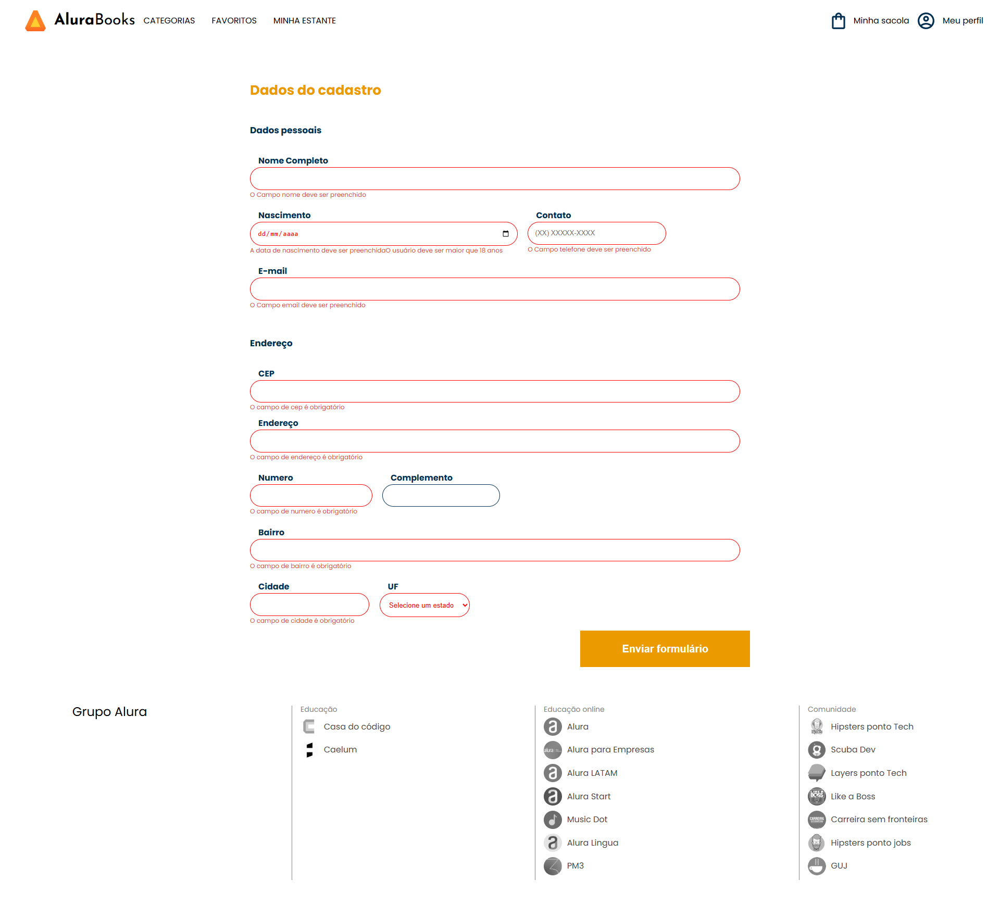
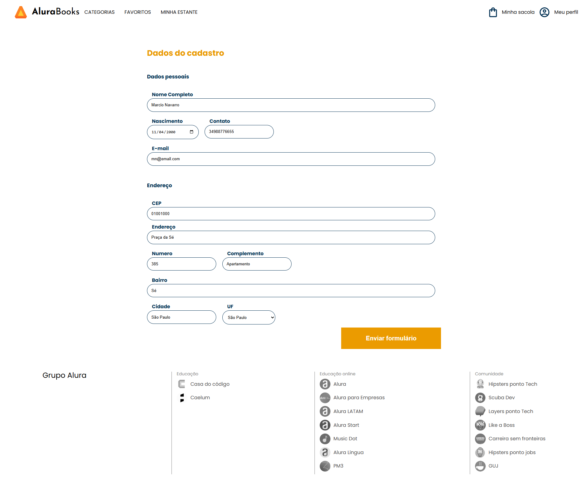

# 🧠 FormsReativos - Projeto Angular
Neste projeto, aprendemos a trabalhar com **formulários reativos** no Angular — desde a criação, validação e envio de dados, até a exibição de mensagens de sucesso e personalização de diretivas para validações específicas..
---

## 🚀 Funcionalidades

✅ Criação e validação de formulários reativos  
✅ Validações personalizadas por diretivas (`maior-idade`, `validando-cep`)  
✅ Consulta de CEP via serviço HTTP  
✅ Feedback visual para erros de formulário  
✅ Mensagens dinâmicas de sucesso após envio  
✅ Arquitetura organizada por módulos, serviços e componentes  

---

## ⚙️ Instalação e Execução

### 🔧 Pré-requisitos
- **Node.js** (versão 16 ou superior)
- **Angular CLI** (v14)

---

### 🖥️ Passo a passo para rodar o projeto

#### 1️⃣ Clone o repositório
```bash
git clone https://github.com/marcionavarro/alura-angular-moderno.git
cd alura-angular-moderno/forms-angular-main
````

2️⃣ Instale as dependências do front-end
```bash
npm install

ng serve 
````

## 🧩 Tecnologias Utilizadas

* Angular 14
* TypeScript
* Reactive Forms
* RxJS
* HTML5 / CSS3


## 📸 Screenshots

### Validação Erro


### Validação Sucesso


### Tela de Sucesso


## 🧑‍💻 Autor

Márcio Navarro  
📍 [github.com/marcionavarro](github.com/marcionavarro)  
Projeto desenvolvido durante os cursos da [Alura](https://www.alura.com.br/).