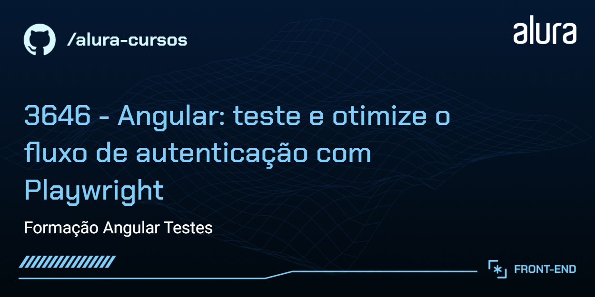
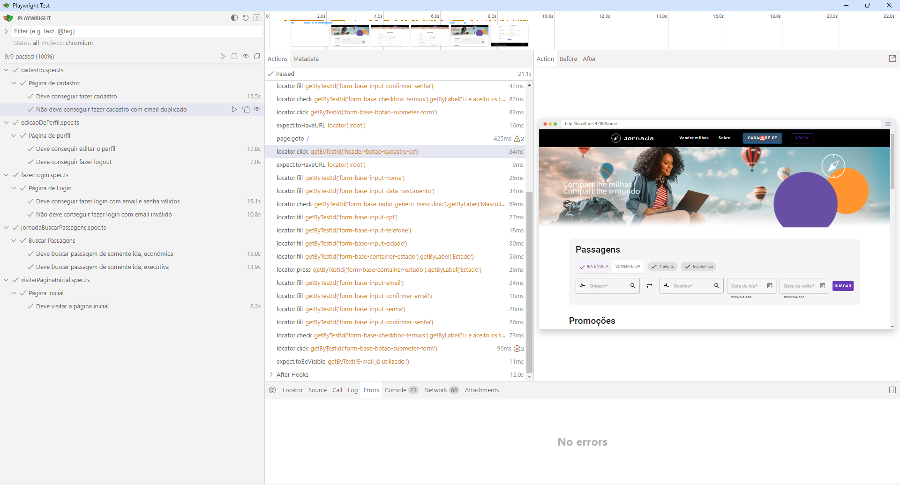
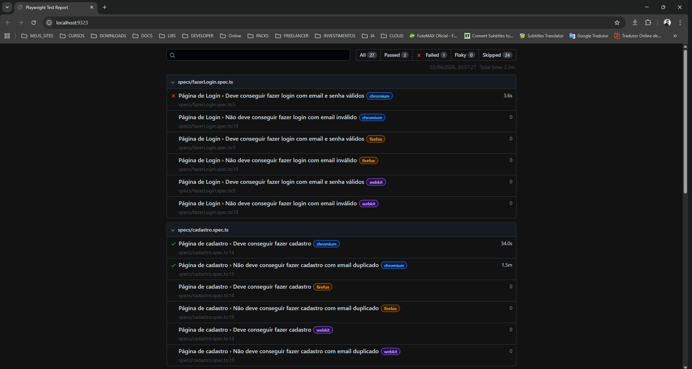

# 🧪 Jornada Milhas - Testes End-to-End

Este repositório contém os testes **End-to-End (E2E)** automatizados para a aplicação **Jornada Milhas**, uma plataforma fictícia de busca de passagens aéreas. Os testes são implementados utilizando **Playwright** para garantir a qualidade e funcionalidade das principais features da aplicação.

## 📋 Visão Geral dos Testes

Os testes E2E cobrem cenários críticos da aplicação, incluindo navegação, autenticação, busca de passagens e edição de perfil. Eles simulam interações reais do usuário para validar o comportamento da aplicação em um navegador.

### Testes Aplicados

- **Visitar Página Inicial**: Valida o carregamento e elementos básicos da página principal.
- **Fazer Login**: Testa login com credenciais válidas e inválidas, incluindo mensagens de erro.
- **Cadastro de Usuário**: Verifica o processo de criação de conta e validações.
- **Edição de Perfil**: Testa atualização de informações do usuário e logout.
- **Buscar Passagens**: Cobre buscas de voos de ida, volta, econômica e executiva, com filtros de passageiros e datas.

## 🛠️ Tecnologias Utilizadas nos Testes

- **Playwright**: Framework para automação de testes E2E em navegadores.
- **TypeScript**: Linguagem para escrever os testes.
- **@faker-js/faker**: Biblioteca para geração de dados fictícios para testes.
- **Page Objects**: Padrão para organizar e reutilizar seletores e ações de página.

## 📋 Pré-requisitos

Antes de executar os testes, certifique-se de ter instalado:

- **Node.js** v20.17.0 ou superior
- **npm** (geralmente vem com Node.js)
- O [back-end da aplicação](https://github.com/marcionavarro/alura-angular-moderno/tree/main/jornada-milhas-api) em execução

## 🚀 Instalação

1. Clone este repositório:
   ```bash
   git clone https://github.com/marcionavarro/alura-angular-moderno
   cd jornada-milhas-playwright-2
   ```

2. Instale as dependências:
   ```bash
   npm install
   ```

## ▶️ Como Executar os Testes

1. Certifique-se de que a aplicação e o back-end estão rodando.

2. Execute todos os testes E2E:
   ```bash
   npm run e2e
   ```

3. Para executar os testes com interface visual do Playwright:
   ```bash
   npm run e2e-ui
   ```

4. Para executar um teste específico:
   ```bash
   npx playwright test specs/nome-do-teste.spec.ts
   ```

5. Para gerar relatório de testes:
   ```bash
   npx playwright show-report
   ```

## 📊 Estrutura dos Testes

```
e2e/
├── specs/                 # Arquivos de teste
│   ├── cadastro.spec.ts
│   ├── edicaoDePerfil.spec.ts
│   ├── fazerLogin.spec.ts
│   ├── jornadaBuscarPassagens.spec.ts
│   └── visitarPaginaInicial.spec.ts
├── page-objects/          # Objetos de página para reutilização
├── operacoes/             # Funções auxiliares (ex: geração de dados)
└── setup/                 # Configurações e fixtures
```

## 📸 Screenshots e Relatórios

Os testes geram screenshots automáticos em caso de falha, salvos em `test-results/`. Para visualizar relatórios detalhados, use o comando `npx playwright show-report` após a execução.

*Exemplo de relatório:*



