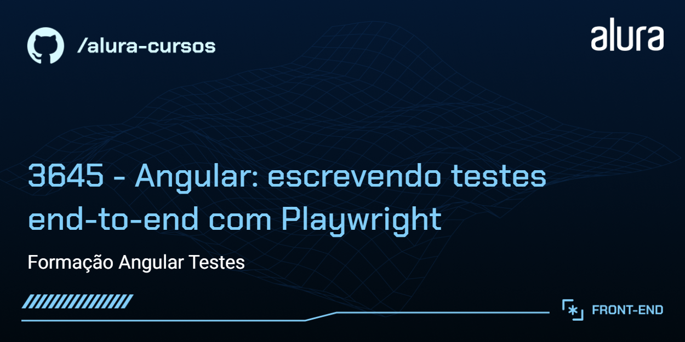
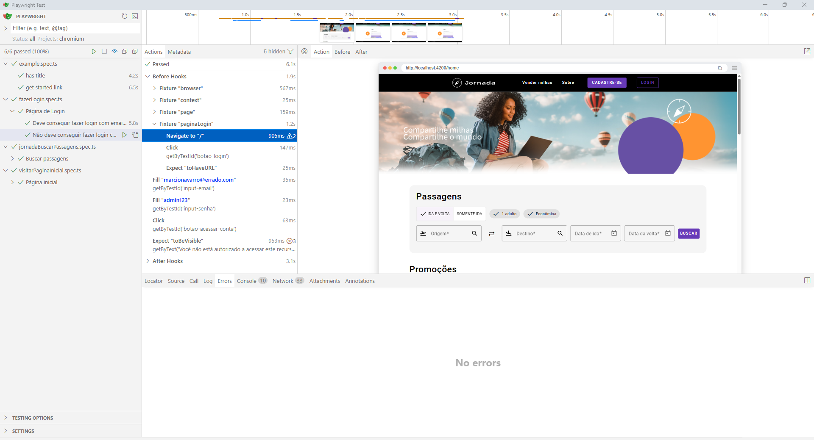

# 🧪 Jornada Milhas - Foco em Testes E2E

O **Jornada Milhas** é uma startup fictícia que oferece um site para busca e reserva de passagens aéreas. Este repositório destaca a implementação de testes end-to-end (E2E) utilizando Playwright para garantir a qualidade e confiabilidade da aplicação. A plataforma permite busca de voos, filtros avançados, autenticação de usuários e muito mais, com ênfase em testes automatizados para validar fluxos críticos.

Acesse o [Figma do Jornada Milhas](https://www.figma.com/file/yz38uH9MvA69Ub3FxNUbTP/Angular-Playwright-%7C-Jornada-Milhas?type=design&node-id=0-1&mode=design) para visualizar o design.

## 📋 Funcionalidades do Projeto

- 🔍 **Busca de Passagens**: Pesquisa e filtros por preço, conexões e companhias.
- 👤 **Autenticação**: Cadastro, login e perfil de usuário.
- 🧪 **Testes E2E**: Cobertura completa com Playwright para validação de cenários reais.

## 🛠️ Tecnologias Utilizadas

- **Angular**: Framework web (versão 16.0.0).
- **Playwright**: Framework para testes E2E (versão 1.58.2).
- **TypeScript**: Linguagem (versão 5.0.2).
- **Node.js**: Ambiente de execução (versão 18 ou superior recomendada).

## 📋 Pré-requisitos

- **Node.js**: Versão 18 ou superior (recomendado: 20.x). Baixe em [nodejs.org](https://nodejs.org/).
- **npm**: Versão 8.x ou superior.

## 🚀 Instalação

1. Clone o repositório:
   ```bash
   git clone https://github.com/marcionavarro/alura-angular-moderno
   cd jornada-milhas-playwright
   ```

2. Instale as dependências:
   ```bash
   npm install
   ```

## ▶️ Como Rodar a Aplicação

1. Inicie o servidor:
   ```bash
   ng serve
   ```

2. Acesse [http://localhost:4200](http://localhost:4200).

## 🧪 Executando os Testes

### Testes Unitários
```bash
ng test
```

### Testes E2E com Playwright
```bash
npm run e2e
```

Para interface gráfica:
```bash
npm run e2e-ui
```

Os testes cobrem cenários como login, busca de passagens e navegação.

## 📸 Screenshots

- **Página Inicial**: 
- **Testes em Execução**: 