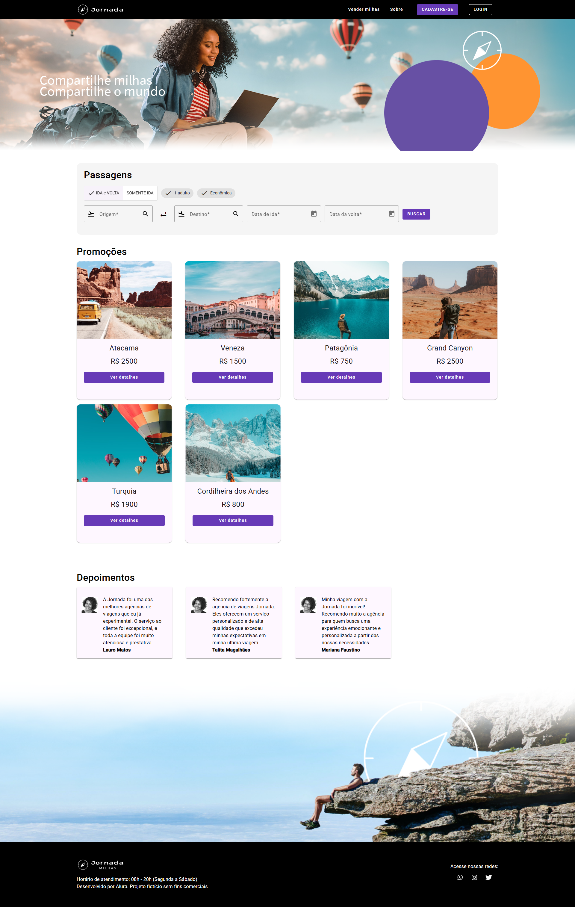
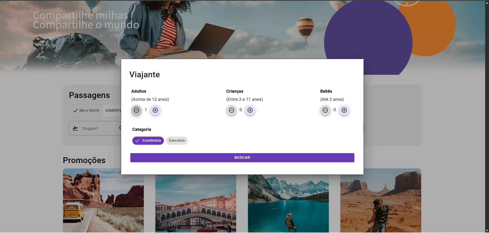
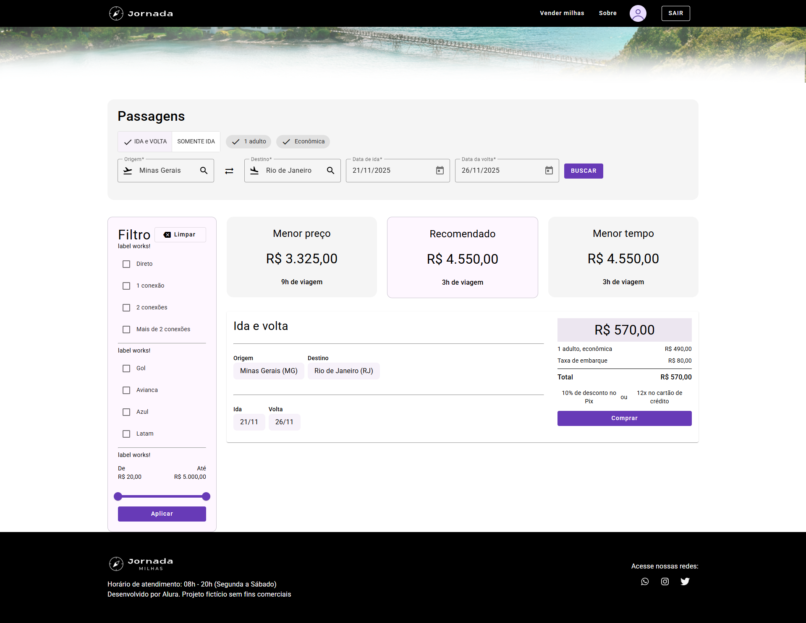
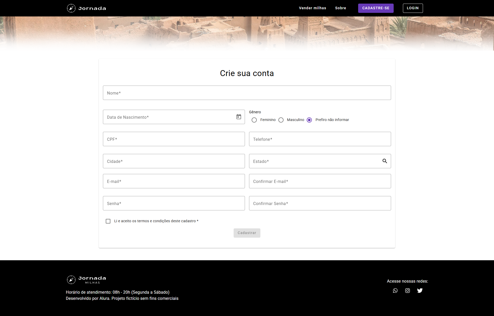
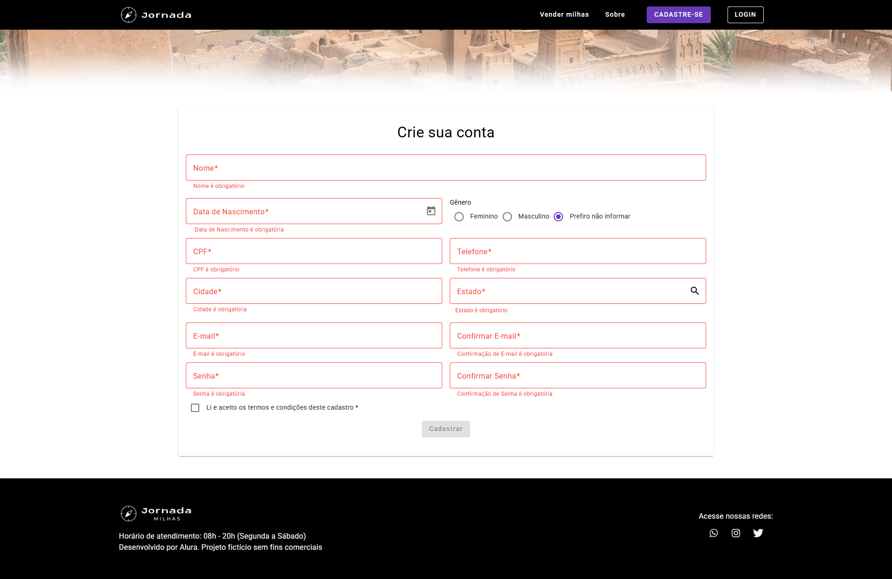
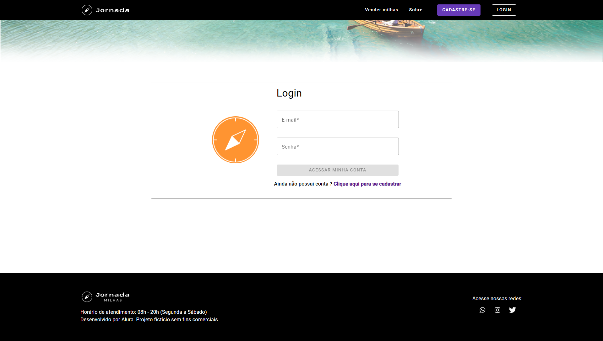
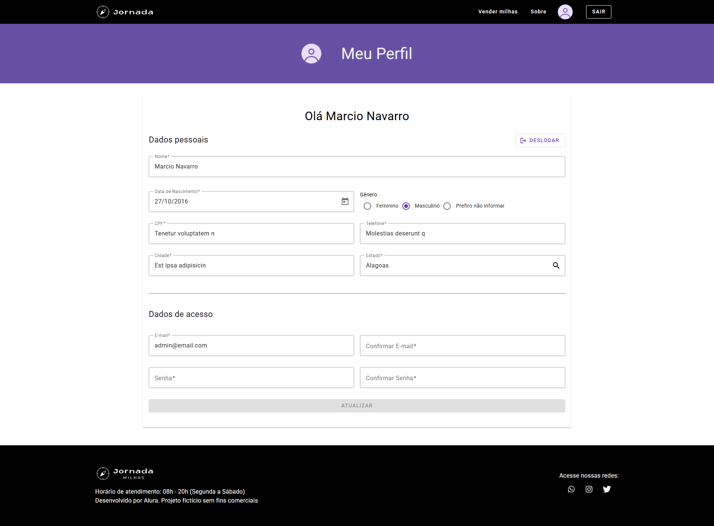

# 🅰️ Jornada Milhas – Formação Alura

Este repositório reúne o projeto final desenvolvido ao longo da **formação Angular da Alura**, que integra diversas funcionalidades aprendidas em diferentes módulos — desde a componentização e design até autenticação JWT, consumo de APIs e aplicação de boas práticas de desenvolvimento com **modularização**, **lazy loading** e **interceptors**.

---

📚 Lista de cursos

1. Angular: componentização e design com Angular Material
2. Angular: componentização, formulários e interação com APIs
3. Angular: trabalhando com Tokens JWT na autenticação e cadastro
4. Angular: buscando, filtrando e exibindo dados de uma API
5. Angular: boas práticas de desenvolvimento com Modularização, Lazy Loading e Interceptors

---

## 🚀 Funcionalidades do sistema

O sistema é uma aplicação Angular completa que simula um ambiente de autenticação, exibição e gerenciamento de dados consumidos de uma API real, com design moderno e estrutura escalável.

### ⚙️ Principais recursos implementados:

- 🧩 **Componentização avançada**  
  Estrutura modular e reutilizável com criação de componentes customizados e compartilhados.

- 🎨 **Design com Angular Material**  
  Utilização de componentes visuais prontos (cards, botões, diálogos, toolbars) e aplicação de temas personalizados.

- 🧾 **Formulários reativos e dinâmicos**  
  Criação de formulários com validações síncronas e assíncronas, tratamento de erros e feedback visual imediato.

- 🌐 **Integração com APIs REST**  
  Consumo de endpoints externos para listagem, criação e atualização de dados via `HttpClient`.

- 🔐 **Autenticação com Tokens JWT**  
  Implementação de login e cadastro com autenticação segura usando JSON Web Token.

- 🧭 **Proteção de rotas e Interceptores**  
  Guardas de rota (`CanActivate`) e interceptadores HTTP para inserir tokens, tratar erros e monitorar requisições.

- 🔍 **Busca, filtragem e exibição de dados**  
  Exibição de resultados dinâmicos com filtros configuráveis, ordenação e paginação de listas.

- 🧱 **Modularização e Lazy Loading**  
  Estrutura otimizada em módulos funcionais carregados sob demanda para melhorar o desempenho da aplicação.

- ✅ **Boas práticas de arquitetura**  
  Separação entre camadas (componentes, serviços, modelos e módulos) e uso de `RxJS` para programação reativa.

---

## 🧠 O que aprendemos

Durante a formação, foram aplicadas técnicas e práticas modernas de **desenvolvimento com Angular**, incluindo:

- ✳️ Criação de **componentes reutilizáveis** e aplicação de design system com Angular Material;  
- 🧭 Desenvolvimento de **rotas, formulários e modais** integrados com APIs REST;  
- 🔐 Implementação de **autenticação JWT** e controle de acesso via **Route Guards**;  
- 🧱 Aplicação de **modularização** e **lazy loading** para otimizar desempenho;  
- 🔁 Uso de **interceptors** para tratamento de erros e injeção automática de tokens;  
- 🔎 Criação de **buscas e filtros reativos** utilizando **RxJS**;  
- 🧰 Organização de código seguindo boas práticas de **arquitetura e clean code**;  
- 🧑‍🦯 Aplicação de **acessibilidade** e padrões **ARIA** para melhor experiência do usuário.

---

## 🧩 Tecnologias utilizadas

| Tecnologia | Descrição |
|-------------|------------|
| **Angular 16** | Framework principal da aplicação |
| **TypeScript** | Linguagem base |
| **RxJS** | Programação reativa e manipulação de streams |
| **Angular Material** | Biblioteca de componentes de UI |
| **JWT** | Autenticação baseada em tokens |
| **HTML5 / CSS3 / SCSS** | Estrutura e estilização |
| **Node.js 16.x** | Ambiente de execução para o Angular CLI |
| **REST API** | Consumo de dados externos |

---

## ⚙️ Como instalar o projeto

### 🔹 Pré-requisitos

Antes de começar, verifique se você possui instalado:
- [Node.js **v16.x**](https://nodejs.org/)
- [Angular CLI **v16+**](https://angular.io/cli)
- NPM (gerenciador de pacotes)

### 🔹 Passos de instalação

```bash
# Clonar o repositório
git clone https://github.com/marcionavarro/alura-angular-moderno

# Entrar na pasta do projeto
cd jornada-milhas

# Instalar as dependências
npm install

# Rodar o projeto
ng serve
```

### 🔹 Passos de instalação da API

```bash
# Clonar o repositório
git clone https://github.com/marcionavarro/alura-angular-moderno

# Entrar na pasta do projeto
cd jornada-milhas-api

# Instalar as dependências
npm install

# Rodar o projeto
npm run start:dev
```

## 📸 Screenshots

### Tela principal Jornada Milhas


### Tela principal e modal Jornada Milhas


### Tela de busca Jornada Milhas


### Tela de cadastro Jornada Milhas


### Tela de cadastro inválido Jornada Milhas


### Tela de login Jornada Milhas


### Tela de perfil Jornada Milhas


---
## 🧑‍💻 Autor

Márcio Navarro  
📍 [https://www.marcionavarro.com.br](https://www.marcionavarro.com.br)  
Projeto desenvolvido durante os cursos da [Alura](https://www.alura.com.br/formacao-aplicacoes-escalaveis-angular?srsltid=AfmBOopngvS-Ilv6fFNm9KrNH08zQyhhiDZTlrVuVQVUIj2fKEZ2ua9E).
