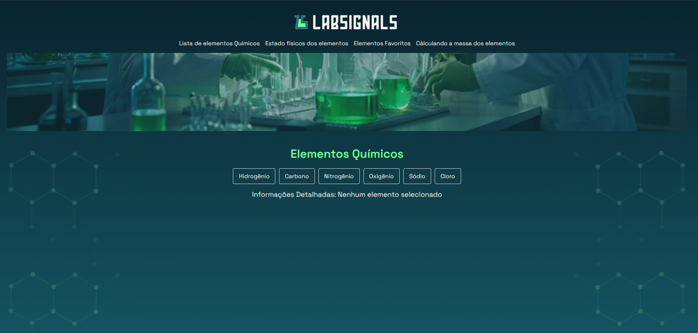
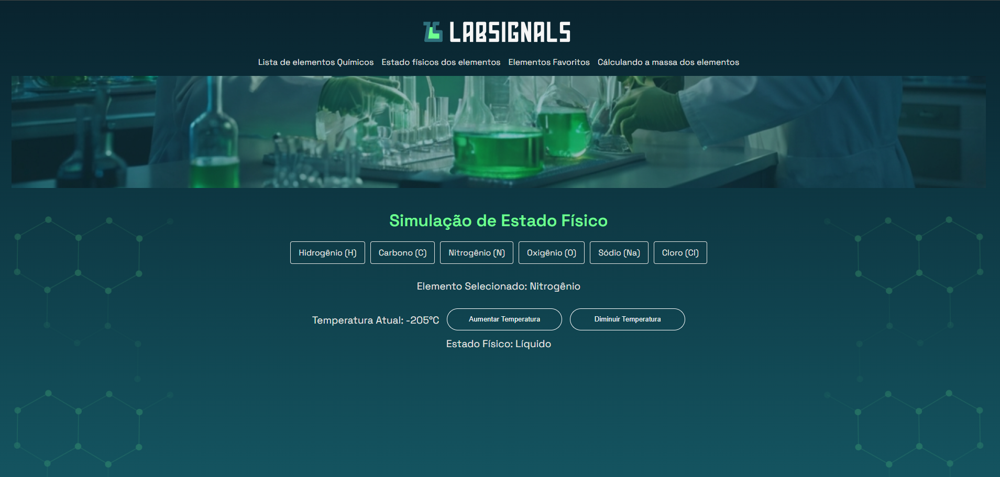
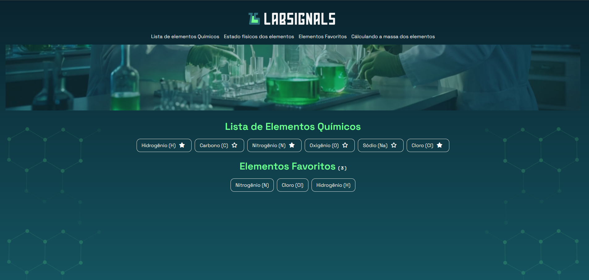

# ✨ Lab Signals


Este projeto é uma aplicação em Angular que explora o uso de Signals para construir interfaces reativas de forma mais simples e intuitiva. A ideia central é demonstrar, na prática, como trabalhar com estado reativo utilizando signals, computed e effects em uma aplicação voltada ao estudo de elementos químicos.

## 🎯 Descrição da Aplicação

A aplicação permite navegar entre diferentes cenários de uso de Signals:

- selecionar um elemento químico e visualizar suas informações;
- alterar a temperatura e observar automaticamente o estado físico do elemento;
- marcar elementos como favoritos;
- calcular a massa atômica total a partir de dois elementos selecionados.

O projeto funciona como uma pequena demonstração didática de como Signals podem substituir ou complementar abordagens mais tradicionais de reatividade em Angular.

## 🧠 O que Aprendemos Neste Projeto

Neste laboratório, foram abordados conceitos fundamentais do Angular moderno, incluindo:

- criação e atualização de Signals;
- uso de computed para derivar valores a partir de outros estados;
- uso de effects para reagir a mudanças de estado;
- organização de estado em serviços compartilhados;
- integração com rotas e componentes reutilizáveis;
- uso de change detection com OnPush.

## 🛠️ Tecnologias Utilizadas

| Tecnologia      | Descrição                                            |
| --------------- | ---------------------------------------------------- |
| Angular 18      | Framework principal para a aplicação                 |
| TypeScript      | Linguagem utilizada no desenvolvimento               |
| RxJS            | Biblioteca para programação reativa                  |
| Angular Router  | Gerenciamento de rotas da aplicação                  |
| Font Awesome    | Ícones visuais utilizados na interface               |
| Karma + Jasmine | Ferramentas de testes                                |
| Node.js + npm   | Ambiente de execução e gerenciamento de dependências |

## 📋 Pré-requisitos e Dependências

Antes de começar, certifique-se de ter instalado:

- Node.js 18 ou superior
- npm 9 ou superior
- Um navegador moderno

As dependências do projeto são definidas no arquivo de configuração do pacote e incluem o Angular CLI, o Angular Core e bibliotecas auxiliares como RxJS e Font Awesome.

## 🚀 Como Clonar, Instalar e Rodar

Siga os passos abaixo:

1. Clone o repositório:

```bash
git clone https://github.com/marcionavarro/alura-angular-moderno
cd lab-signals
```

2. Instale as dependências:

```bash
npm install
```

3. Inicie o servidor de desenvolvimento:

```bash
npm start
```

4. Acesse a aplicação no navegador:

```text
http://localhost:4200
```

### Comandos úteis

- Executar testes:

```bash
npm test
```

- Criar build de produção:

```bash
npm run build
```

## 📸 Screenshots

- Tela inicial com a navegação entre os exemplos de Signals

  

- Página de seleção de elementos químicos

  

- Página mostrando o estado físico baseado na temperatura

  

- Página de favoritos

  

- Página de cálculo de massa atômica

  

## 📁 Estrutura de Diretórios

A estrutura do projeto está organizada da seguinte forma:

```text
src/
  app/
    computed-signal/     # exemplo de computed signals
    effects/             # exemplo de effects
    elemento-details/    # detalhes do elemento selecionado
    elemento-list/       # lista de elementos químicos
    signals-intro/       # introdução ao uso de signals
    elemento.service.ts  # serviço com estado compartilhado
    app-routing.module.ts
    app.component.ts
    app.module.ts
  assets/                # imagens e recursos da aplicação
```

## 📚 Recursos e Links Úteis

- Documentação oficial do Angular: https://angular.dev/
- Guia de Signals no Angular: https://angular.dev/guide/signals
- Documentação de RxJS: https://rxjs.dev/
- Documentação do Angular Router: https://angular.io/guide/router
