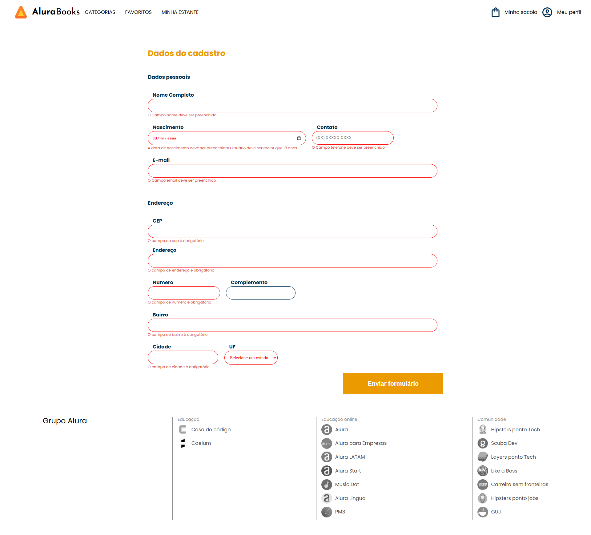
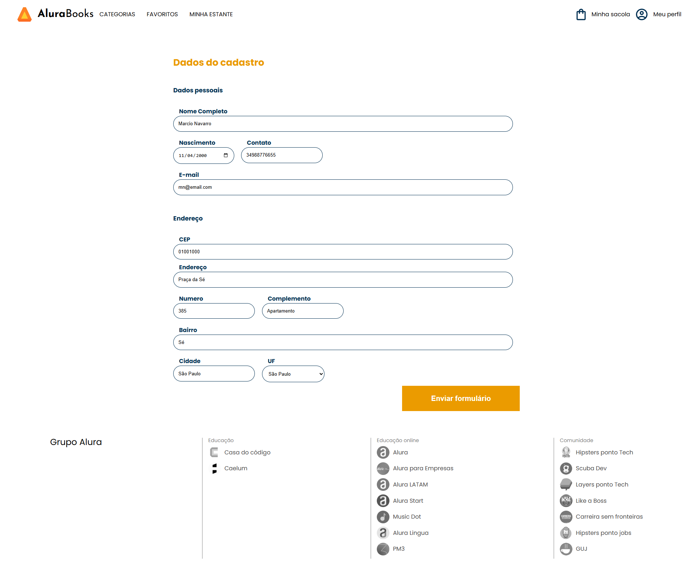
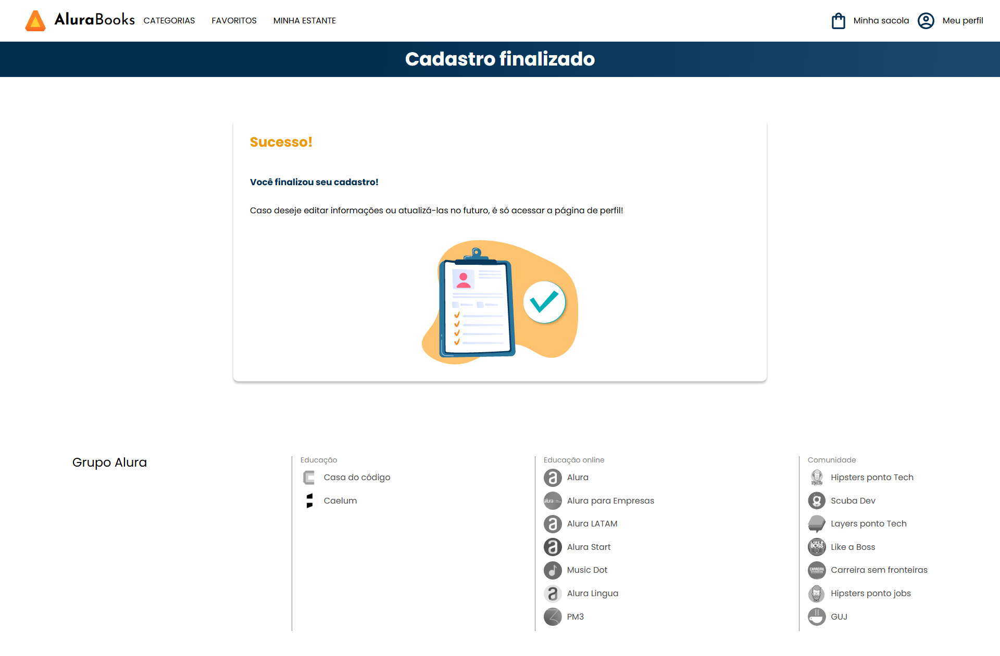

# 🛒 Lista de Compras - Projeto Angular
construímos um **app de lista de compras** e exploramos as **etapas do ciclo de vida dos componentes no Angular**, aplicando conceitos fundamentais de reatividade e gerenciamento de estado local com `localStorage`.
---

## 🚀 Funcionalidades

✅ Adicionar novos itens à lista de compras  
✅ Editar e excluir itens  
✅ Marcar itens como concluídos  
✅ Limpar toda a lista com um clique  
✅ Persistência de dados no **localStorage**  
✅ Exibição de data e hora do item adicionado   

---


## 🧠 Hooks do Ciclo de Vida do Angular

Este projeto foi criado com foco em **entender os principais lifecycle hooks** do Angular e suas aplicações práticas:

| Hook | Função | Aplicação no Projeto |
|------|---------|----------------------|
| `OnInit` | Executado na inicialização do componente | Utilizado para carregar a lista de compras armazenada no `localStorage` |
| `DoCheck` | Chamado a cada detecção de mudanças | Usado para atualizar automaticamente o `localStorage` sempre que há modificações na lista |
| `OnDestroy` | Executado antes de o componente ser destruído | Ideal para liberar recursos ou salvar o estado antes do fechamento da aplicação |

Esses hooks permitem entender **quando e como o Angular detecta e reage às mudanças** no ciclo de vida do componente, oferecendo maior controle sobre o comportamento da aplicação.

## ⚙️ Instalação e Execução

### 🔧 Pré-requisitos
- **Node.js** (versão 16 ou superior)
- **Angular CLI** (v14)

---

### 🖥️ Passo a passo para rodar o projeto

#### 1️⃣ Clone o repositório
```bash
git clone https://github.com/marcionavarro/alura-angular-moderno.git
cd alura-angular-moderno/life-cycle
````

2️⃣ Instale as dependências
```bash
npm install
````

3️⃣ Rode o servidor de desenvolvimento
```bash
npm start
````


## 🧩 Tecnologias Utilizadas

* Angular 14
* TypeScript
* LocalStorage
* HTML5 / CSS3


## 📸 Screenshots

### Validação Erro


### Validação Sucesso


### Tela de Sucesso



## 🧑‍💻 Autor

Márcio Navarro  
📍 [github.com/marcionavarro](github.com/marcionavarro)  
Projeto desenvolvido durante os cursos da [Alura](https://www.alura.com.br/).