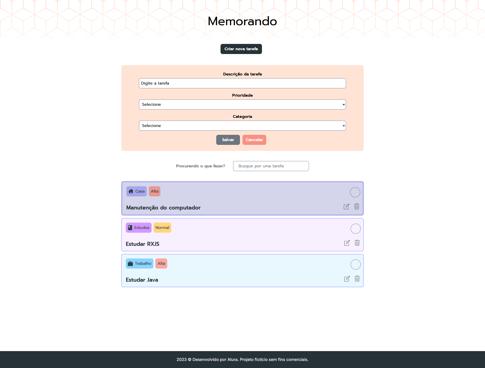
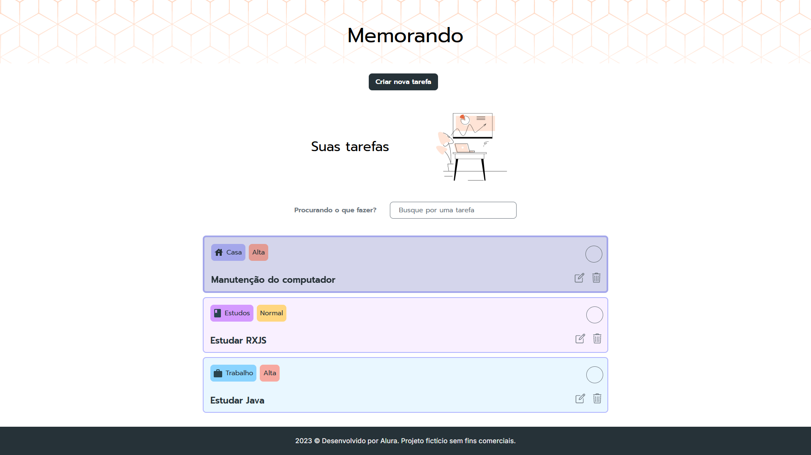
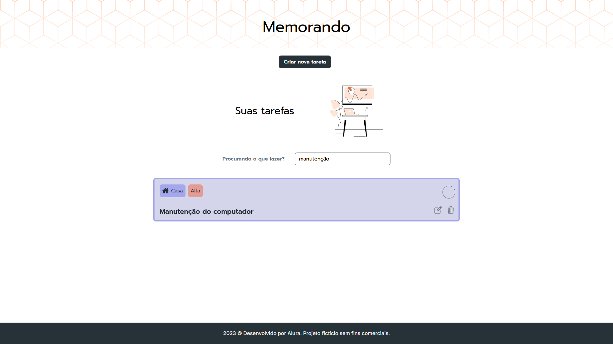
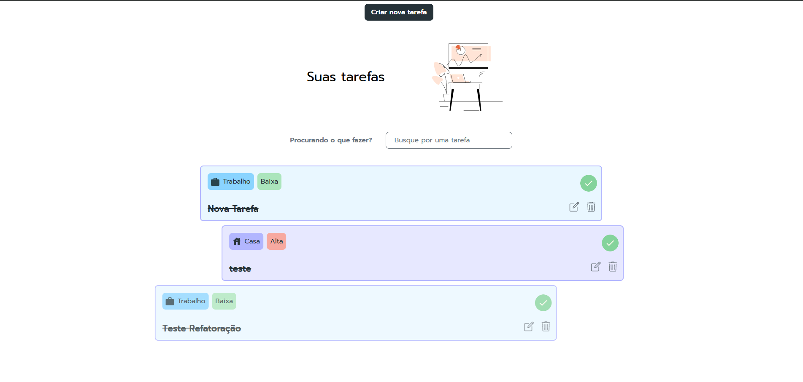

# 📝 Memorando

O objetivo é aplicar animações avançadas em Angular para criar interfaces mais dinâmicas e envolventes.

---

## 🧠 Tecnologias e Conceitos Aprendidos

- **Angular (versão atual)**
- **Angular Animations API**:
  - `keyframes()`, `transition()`, `trigger()`, `style()`, `animate()`
  - `group()`, `query()`, `stagger()`
  - `cubic-bezier()` e `offset`
- **RxJS**:
  - Uso de `BehaviorSubject` para controle reativo de estados e animações
- **Boas práticas de UX/UI com foco em animações**
- **Refatoração e modularização de componentes animados**

--- 

## ⚙️ Funcionalidades do Sistema

- 🔍 Campo de busca animado com `keyframes` e curvas de tempo personalizadas  
- 🎛️ Botão com múltiplas animações simultâneas (`group`)  
- ✨ Destaque visual de elementos com `query()` e `keyframes()`  
- 📋 Listagem de itens animada com `stagger()`  
- 🚫 Desativação seletiva de animações (acessibilidade e performance)  
- 🔁 Controle reativo com `BehaviorSubject` para alternância de estados e animações

---

## ⚙️ Versão do Node.js (recomendada)

Recomendado usar Node.js LTS. Este projeto foi desenvolvido para funcionar com:

- Node.js 18.x (recomendado)
- Compatível também com Node.js 16.13+ (se necessário)

Você pode verificar sua versão atual do Node.js com:

```powershell
node -v
```

Se precisar instalar ou trocar de versão, recomendamos usar nvm (Node Version Manager) ou nvm-windows.

## 📦 Instalação e execução

Siga os passos abaixo para rodar a aplicação localmente. Abra dois terminais (um para o backend e outro para o frontend).

1. Clone o repositório (se ainda não clonou):

```powershell
git clone https://github.com/marcionavarro/alura-angular-moderno
cd memorando
```

2. Instalar dependências do frontend (na raiz do projeto):

```powershell
npm install
```

3. Instalar dependências do backend e iniciar o json-server (em outro terminal):

```powershell
cd backend
npm install
npm start
# O json-server irá rodar em http://localhost:3000 por padrão
```

4. Iniciar a aplicação Angular (no terminal do frontend, na raiz do projeto):

```powershell
cd ..\
npm start
# O Angular Dev Server irá rodar em http://localhost:4200 por padrão
```

5. Abrir no navegador:

- Frontend: http://localhost:4200
- API (json-server): http://localhost:3000


## 🖼️ Screenshots

### Tela com formulario show


### Tela com formulario hide


### Tela de busca


### Tela de entrada com animação


---

🧑‍💻 Autor  
Márcio Navarro  
📍 https://marcionavarro.com.br  
Projeto desenvolvido durante os cursos da Alura.