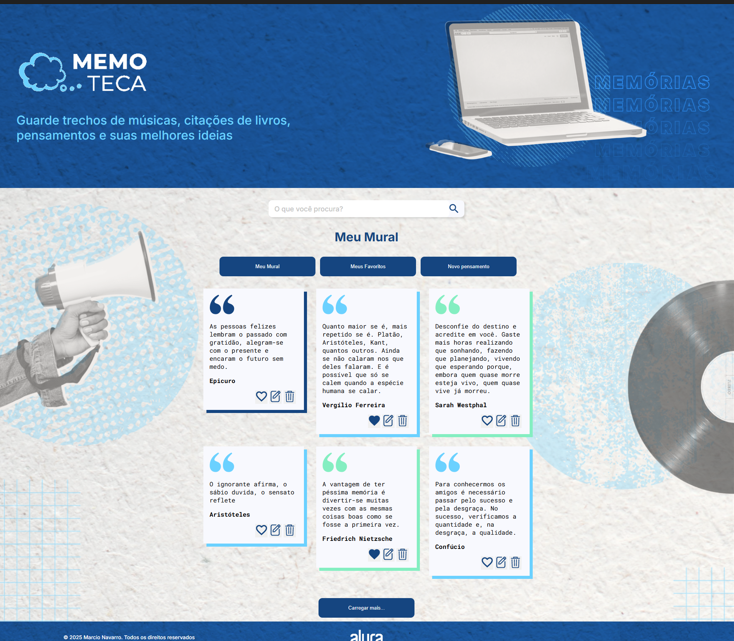
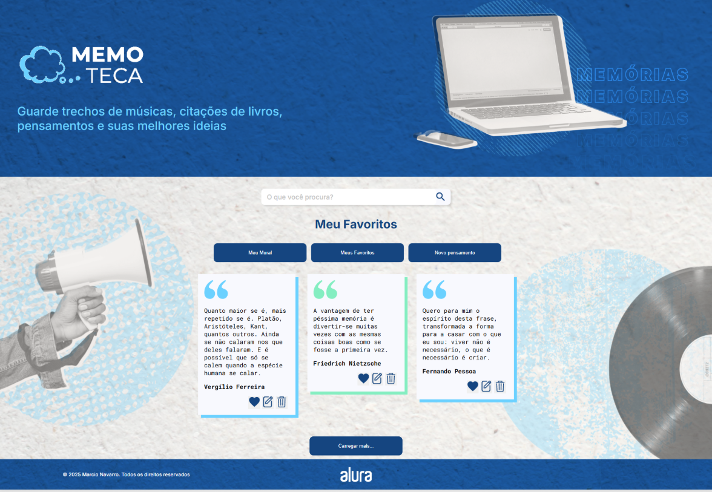
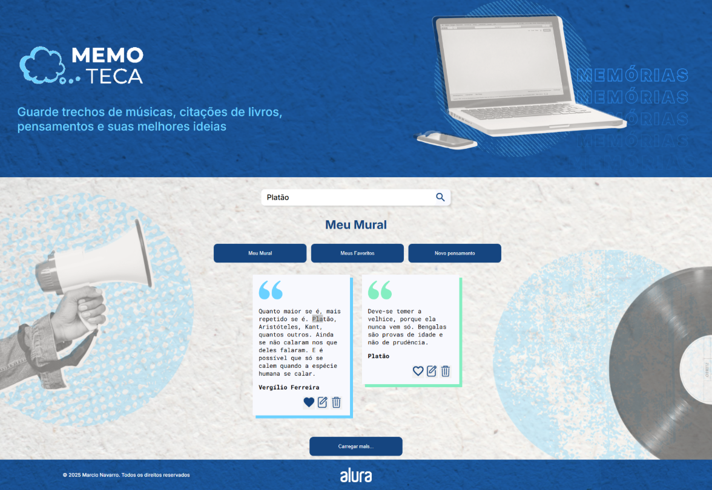

# 🧠 Memoteca - Projeto Angular
Guarde trechos de músicas, citações de livros, pensamentos e suas melhores ideias.
---

## 🚀 Funcionalidades

✅ Cadastro e exibição de citações, pensamentos e frases inspiradoras  
✅ Organização de conteúdos favoritos  
✅ Interface moderna e responsiva  
✅ Busca dinâmica de pensamentos  
✅ Integração com backend JSON local  

---

## ⚙️ Instalação e Execução

### 🔧 Pré-requisitos
- **Node.js** (versão 16 ou superior)
- **Angular CLI** (v14)
- **JSON Server** para o backend fake

---

### 🖥️ Passo a passo para rodar o projeto

#### 1️⃣ Clone o repositório
```bash
git clone https://github.com/marcionavarro/alura-angular-moderno.git
cd alura-angular-moderno
````

2️⃣ Instale as dependências do front-end
```bash
npm install
````

2️⃣ Suba o servidor JSON (backend)
```bash
cd backend
npm install
npm start ou npx json-server --watch db.json --port 3000
````

O servidor backend estará disponível em:  
👉 http://localhost:3000/pensamentos  

2️⃣ Suba o servidor JSON (backend)
```bash
cd ..
npm start
````  

## 🧩 Tecnologias Utilizadas

* Angular 14
* TypeScript
* RxJS
* HTML5 / CSS3
* JSON Server
* Node.js


## 📸 Screenshots

### Meu Mural


### Meus Favoritos


### Pesquisa


### Cadastro de Pensamento


## 🧑‍💻 Autor

Márcio Navarro  
📍 [github.com/marcionavarro](github.com/marcionavarro)  
Projeto desenvolvido durante os cursos da [Alura](https://www.alura.com.br/).