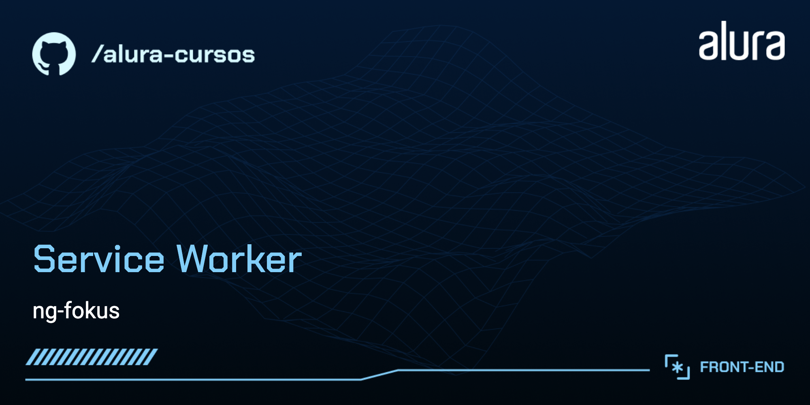
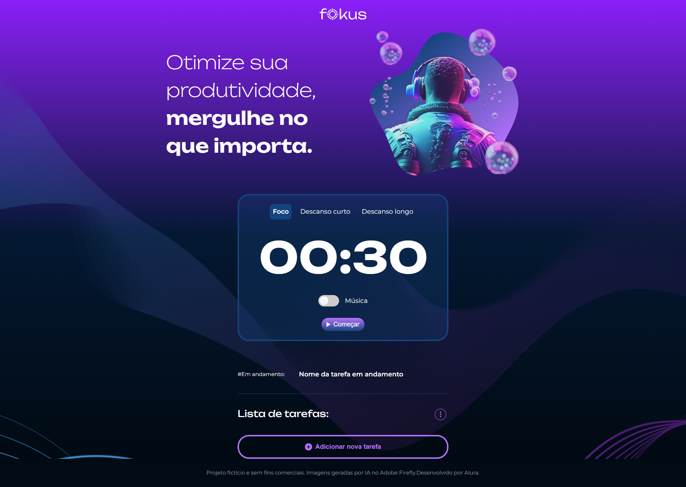
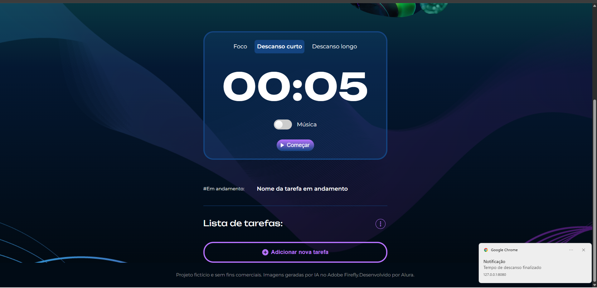
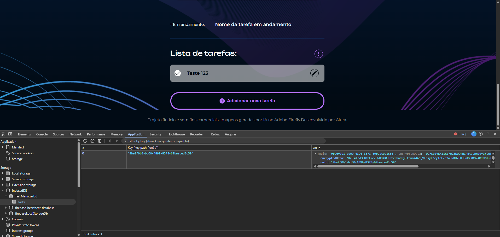

<p align="center">
  
</p>

# ⏱️ ng-fokus

> Uma aplicação moderna baseada no clássico site **Pomofocus** e no método **Pomodoro**, desenvolvida com **Angular 17** e equipada com recursos avançados de **PWA (Progressive Web App)** para funcionamento offline, notificações desktop e armazenamento seguro local.

---

## 🎯 Sobre o Projeto

O **ng-fokus** é um gerenciador de tarefas integrado a um timer Pomodoro interativo. O principal objetivo é auxiliar usuários a maximizarem seu foco e produtividade, dividindo o trabalho em blocos de tempo concentrado separados por breves intervalos de descanso.

A aplicação se adapta visualmente ao modo atual selecionado (Foco, Descanso Curto ou Descanso Longo) e foi desenvolvida com foco total em **performance**, **acessibilidade** e **experiência offline**.

---

## ✨ Principais Funcionalidades

- **⏱️ Cronômetro Pomodoro Inteligente**: Alternância dinâmica entre períodos de foco (30s), descanso curto (5s) e descanso longo (15s) (configurados para facilidade de demonstração/teste).
- **🎵 Controle Sonoro Avançado**: Efeitos de som para iniciar, pausar e finalizar ciclos, além de uma trilha sonora ambiente de fundo relaxante (_Luna Rise_), controlada pela biblioteca **Howler.js**.
- **📋 Gerenciador de Tarefas Embutido**: Crie, selecione, execute e descarte tarefas de forma simples e intuitiva.
- **🔒 Segurança dos Dados**: Todas as tarefas cadastradas pelo usuário são criptografadas em **AES-256** antes de serem persistidas localmente.
- **💾 Armazenamento Offline com IndexedDB**: Persistência de tarefas localmente no navegador por meio do IndexedDB, garantindo que nenhum dado seja perdido mesmo sem internet.
- **📡 Recursos PWA Completo**:
  - Funciona totalmente offline com cache automatizado de assets via Angular Service Worker.
  - Notificações nativas no desktop/celular para avisar o término de cada ciclo.
  - Detecção inteligente do status de conexão à internet com avisos em tempo real ("Você está online :)" / "Você está offline :(").
  - Atualização inteligente em segundo plano quando novas versões da aplicação são publicadas.

---

## 📸 Screenshots

### Tela Principal e Modos de Uso

<p align="center">
  
</p>

### Tela Principal com Notificação Push

<p align="center">
  
</p>

### Tela Principal cadastro de Tarefa e inserção dos dados criptografados no banco de dados indexedDB

<p align="center">
  
</p>

---

## 🛠️ Tecnologias Utilizadas

A tabela abaixo detalha as principais tecnologias e bibliotecas integradas ao ecossistema do **ng-fokus**:

| Tecnologia / Dependência   | Versão / Tipo    | Descrição e Propósito no Projeto                                                      |
| :------------------------- | :--------------- | :------------------------------------------------------------------------------------ |
| **Angular**                | `^17.1.0`        | Framework web robusto para a estrutura de componentes autônomos (Standalone).         |
| **TypeScript**             | `~5.3.2`         | Linguagem base para desenvolvimento Angular, garantindo tipagem estática e segurança. |
| **RxJS**                   | `~7.8.0`         | Biblioteca para programação reativa baseada em Observables e fluxos de dados.         |
| **Howler.js**              | `^2.2.4`         | Biblioteca JavaScript de áudio utilizada para controle de sons e trilha sonora.       |
| **Crypto-JS**              | `^4.2.0`         | Algoritmos de criptografia para proteger os dados das tarefas em AES no cliente.      |
| **IndexedDB**              | Nativo (Browser) | Banco de dados não-relacional nativo do navegador usado para persistência local.      |
| **Angular Service Worker** | `^17.1.0`        | Configuração de PWA para caching, atualizações inteligentes e uso offline.            |
| **UUID**                   | `^11.0.2`        | Biblioteca para geração de chaves únicas universais para as tarefas.                  |
| **SASS (SCSS)**            | Nativo           | Pré-processador CSS para estilização moderna, limpa e flexível.                       |
| **Express**                | `^4.18.2`        | Servidor Node de apoio para o setup de Server-Side Rendering (SSR).                   |

---

## 📋 Pré-requisitos e Dependências

Para baixar, instalar e rodar o projeto localmente, você precisará de:

- **Node.js** (Versão recomendada: `18.x` ou superior)
- **NPM** (Gerenciador de pacotes padrão do Node)
- **Angular CLI** (Opcional, mas útil: `npm install -g @angular/cli@17`)

---

## 🚀 Instruções de Instalação e Execução

### 1. Clonar o Repositório

```bash
git clone https://github.com/marcionavarro/alura-angular-moderno
cd ng-fokus
```

### 2. Instalar as Dependências

Instale todas as dependências do projeto listadas no `package.json`:

```bash
npm install
```

### 3. Rodar o Servidor de Desenvolvimento

Inicie o servidor de desenvolvimento local. A aplicação será recompilada e ficará disponível para acesso rápido.

```bash
npm start
```

Após o build inicial, abra o navegador em: [http://localhost:4200/](http://localhost:4200/)

### 4. Build de Produção

Para compilar a aplicação com todas as otimizações de produção habilitadas:

```bash
npm run build
```

### 5. Execução em Modo PWA Local (Offline e Service Worker)

Os Service Workers são desabilitados por padrão no modo de desenvolvimento. Para testar o comportamento offline e os recursos do Service Worker localmente, gere a build de produção e utilize um servidor estático leve na pasta gerada:

```bash
# 1. Gere o build de produção
npm run build

# 2. Navegue até a pasta de distribuição do browser e inicie um servidor HTTP local
npx http-server dist/ng-fokus/browser
```

Acesse a URL exibida no console (geralmente [http://127.0.0.1:8080](http://127.0.0.1:8080)) para simular a aplicação com cache offline ativo!

---

## 📁 Estrutura de Diretórios

A organização do código-fonte dentro do diretório `/src` segue as melhores práticas do Angular 17+:

```
ng-fokus/
├── src/
│   ├── app/
│   │   ├── shared/
│   │   │   ├── components/
│   │   │   │   ├── banner/            # Componente visual de cabeçalho promocional/banner
│   │   │   │   ├── footer/            # Rodapé informativo da página
│   │   │   │   ├── header/            # Topo da página com a logomarca e controles
│   │   │   │   ├── task-manager/      # Gerenciador de tarefas (adição, exclusão e seleção)
│   │   │   │   └── timer-control/     # Cronômetro visual e seleção dos modos Pomodoro
│   │   │   └── services/
│   │   │       ├── audio.service.ts          # Controle de músicas e alertas (Howler.js)
│   │   │       ├── cache-inspector.service.ts # Monitoramento e inspeção de caches offline
│   │   │       ├── connectivity.service.ts   # Observador reativo do status de internet (Online/Offline)
│   │   │       ├── context.service.ts        # Estado compartilhado dos contextos do temporizador
│   │   │       ├── indexed-db.service.ts     # Interface de CRUD e criptografia de tarefas no IndexedDB
│   │   │       ├── notification.service.ts   # Desparo e gerenciamento de notificações do navegador
│   │   │       └── update.service.ts         # Detecção e aplicação de novos updates do PWA
│   │   ├── app.component.ts           # Componente raiz da aplicação
│   │   ├── app.module.ts              # Declarações e importações dos módulos principais
│   │   └── app.routes.ts              # Configurações de rotas da aplicação
│   ├── assets/                        # Recursos de mídia (sons em mp3/wav, imagens e ícones)
│   ├── index.html                     # HTML principal de entrada
│   ├── manifest.webmanifest          # Metadados de instalação do PWA
│   └── styles.scss                    # Estilos globais
├── angular.json                       # Configurações do Angular CLI
└── ngsw-config.json                   # Estratégia de cache offline do Service Worker
```

---

## 📚 O Que Aprendemos Neste Projeto

Durante a criação e refatoração do **ng-fokus**, colocamos em prática diversos conceitos fundamentais do desenvolvimento web moderno com Angular:

1. **Arquitetura Baseada em Componentes e Signals**: Utilização de conceitos do Angular moderno para gerenciar estados reativos e efeitos colaterais de forma limpa e otimizada (`Signals` e `effect()`).
2. **Criação e Registro de PWAs**: Configuração inteligente de estratégias de cache (estático e dinâmico) usando `ngsw-config.json` para permitir que o app abra instantaneamente sem conexão ativa.
3. **Criptografia Simétrica no Cliente**: Prática de boas práticas de segurança, cifrando strings de dados confidenciais com **AES-256** (`CryptoJS`) antes de inseri-las em bancos de dados do navegador.
4. **Integração com APIs do Navegador**:
   - Controle do ciclo de notificações através de permissões do usuário e da API `Notification`.
   - Utilização do `window.navigator.onLine` e eventos de rede para detectar perdas de sinal em tempo real.
5. **Manipulação Avançada de Áudio**: Uso do Howler.js para evitar problemas de compatibilidade e latência na reprodução e pausa de sons nativos do navegador.

---

## 🔗 Recursos e Links Úteis

- [Documentação Oficial do Angular](https://angular.dev/)
- [Guia do Angular Service Worker](https://angular.dev/guide/service-worker/getting-started)
- [Howler.js - Documentação Oficial](https://howlerjs.com/)
- [Técnica Pomodoro - Artigo explicativo](https://pt.wikipedia.org/wiki/T%C3%A9cnica_pomodoro)
- [Repositório Original do Projeto](https://github.com/Charlinho/ng-fokus)

---

Desevolvido para fins de aprendizado e consolidação de conceitos avançados de Angular e PWA. 🚀
