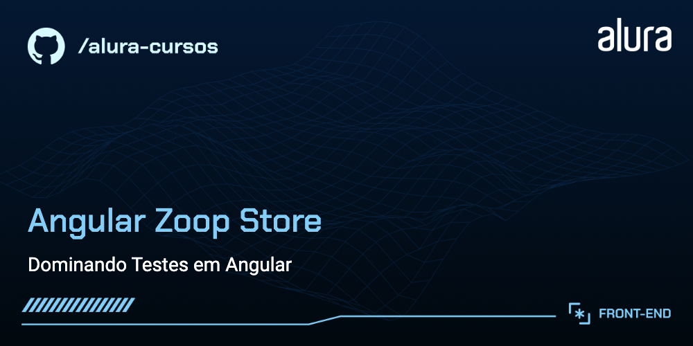
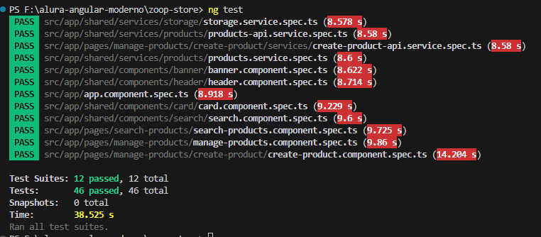
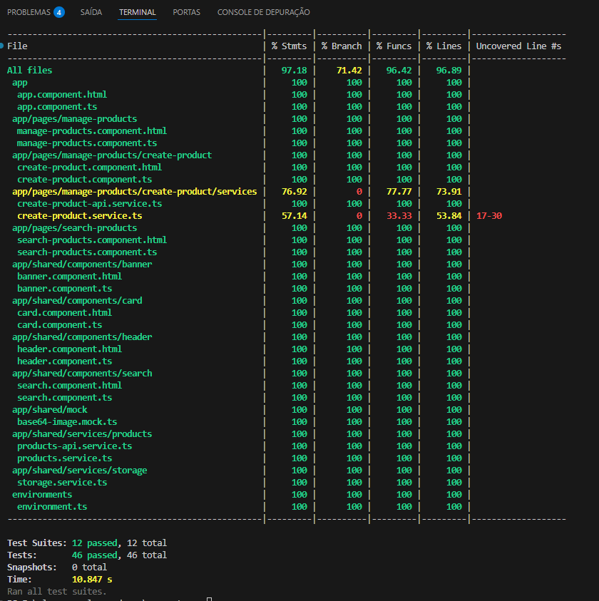
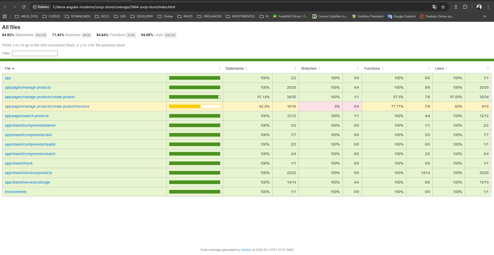

<div align="center">



# 🧪 Zoop Store - Dominating Tests in Angular

Um e-commerce desenvolvido com **Angular 17** com foco em **testes unitários e de integração** profissionais.

[](https://angular.io)
[](https://jestjs.io)
[](https://www.typescriptlang.org)
[](.)

</div>

---

## 🎯 Objetivo

A **Zoop Store** é um projeto educacional da **Alura** que serve como laboratório prático para dominar **testes em Angular**. O foco principal é demonstrar como construir uma aplicação moderna e profissional mantendo alta cobertura de testes, utilizando as melhores práticas e padrões reconhecidos pela comunidade Angular.

---

## 🔨 Funcionalidades do Projeto

O App oferece uma prática lista de produtos, apresentando:

- 📦 **Detalhes Completos**: Título, valor, descrição, categoria e imagem
- 🔍 **Busca e Filtros**: Encontre produtos facilmente
- ➕ **CRUD Completo**: Crie, leia, atualize e delete produtos
- 📜 **Scroll Infinito**: Carregamento automático de produtos
- 💾 **Armazenamento Local**: Dados persistidos no localStorage
- 🎨 **Interface Moderna**: Design responsivo com Material Design

O [Figma dessa aplicação você encontra aqui](https://www.figma.com/file/ghzMuGeV2n1ninpw2HaMCg/Dominando-Testes-em-Angular?type=design&node-id=9-457&mode=design&t=TuxafGqTTi1CWk5i-0).

---

## 🧪 Foco Principal: Testes em Angular

Este projeto é **100% focado em testes**. Aprenda a:

### ✅ Testes Unitários
- Testes de **componentes** isolados
- Testes de **serviços** e dependências
- **Mocking** de serviços HTTP
- **Spy** e **stub** em Jest

### ✅ Testes de Integração
- Comunicação entre componentes
- Fluxos de dados com RxJS
- Injeção de dependência em testes

### ✅ Cobertura de Código
- Atingir **70%+** de cobertura
- Identificar pontos críticos
- Relatórios detalhados com LCOV

### ✅ Padrões de Teste
- **AAA Pattern** (Arrange, Act, Assert)
- **Fixtures** e **Setup/Teardown**
- **Test Doubles** (Mocks, Spies, Stubs)

| Padrão | Descrição |
|--------|-----------|
| **AAA** | Organize testes em 3 fases: preparação, ação, verificação |
| **Mocks** | Substitua dependências externas |
| **Spies** | Monitore chamadas e retornos |
| **Stubs** | Replique comportamentos específicos |

---

## ✔️ Técnicas e Tecnologias Utilizadas

### 🧪 Testing & Quality
- **Jest**: Framework de testes (v29.7)
- **Testing Library**: Testes de componentes
- **Coverage Reports**: Cobertura com LCOV

### 🎨 Frontend & UI
- **Angular**: Framework principal (v17.1)
- **Angular Material**: Componentes prontos
- **Angular CDK**: Auxiliares avançados
- **Figma**: Design da aplicação

### ⚙️ Backend & Dados
- **RxJS**: Programação reativa
- **HttpClient**: Requisições API
- **LocalStorage**: Persistência de dados

### 🛠️ Ferramentas de Dev
- **Angular CLI**: Builds e geração
- **TypeScript**: Type safety
- **Node.js**: Runtime

---

## 🚀 Como Executar e Testar

### Instalação

```bash
# Clone o repositório
git clone https://github.com/marcionavarro/alura-angular-moderno
cd zoop-store

# Instale as dependências
npm install
```

### Desenvolvimento

```bash
# Inicie o servidor
npm start

# Acesse em seu navegador
http://localhost:4200
```

### 🧪 Executando Testes

```bash
# Rode todos os testes
npm test || ng test

# Modo watch (testes em tempo real)
npm test -- --watch

# Com cobertura completa
npm run test:coverage

# Apenas um arquivo específico
npm test -- search-products.component.spec.ts

# Modo debug
npm test -- --debug
```

### 📊 Visualizando Cobertura

```bash
# Gera relatório de cobertura
npm run test:coverage

# Abre o relatório em HTML (coverage/lcov-report/index.html)
```

---

## 📁 Estrutura dos Testes

```
src/app/
├── pages/
│   ├── search-products/
│   │   ├── search-products.component.ts
│   │   ├── search-products.component.spec.ts    ✅ Testes
│   │   └── ...
│   └── manage-products/
│       ├── manage-products.component.ts
│       ├── manage-products.component.spec.ts    ✅ Testes
│       └── create-product/
│           ├── create-product.component.ts
│           ├── create-product.component.spec.ts ✅ Testes
│           └── services/
│               ├── create-product.service.ts
│               └── create-product.service.spec.ts ✅ Testes
├── shared/
│   ├── components/
│   │   ├── card/
│   │   │   ├── card.component.ts
│   │   │   └── card.component.spec.ts           ✅ Testes
│   │   ├── search/
│   │   ├── header/
│   │   └── banner/
│   └── services/
│       ├── products/
│       │   ├── products.service.ts
│       │   ├── products.service.spec.ts         ✅ Testes
│       │   └── products-api.service.ts
│       └── storage/
│           ├── storage.service.ts
│           └── storage.service.spec.ts          ✅ Testes
```


## 📊 Métricas de Cobertura

| Aspecto | Meta | Status |
|--------|------|--------|
| **Line Coverage** | 70% | ✅ |
| **Branch Coverage** | 60% | ✅ |
| **Function Coverage** | 70% | ✅ |
| **Statement Coverage** | 70% | ✅ |

Visualize detalhadamente em: `coverage/lcov-report/index.html`

---
## 🖼️ Screenshots





---

## 🎓 Conceitos Abordados

### ✅ Basics de Testes
- [ ] O que é e por que testar?
- [ ] Tipos de testes (unitário, integração, e2e)
- [ ] Estrutura de um teste
- [ ] BDD vs TDD

### ✅ Jest Essentials
- [ ] Setup e configuração
- [ ] Matchers e assertions
- [ ] Mocks e spies
- [ ] Coverage reporting

### ✅ Angular Testing
- [ ] TestBed e fixture
- [ ] ComponentFixture
- [ ] DebugElement
- [ ] Async e fakeAsync

### ✅ Testes Avançados
- [ ] Testes de serviços HTTP
- [ ] Testes de formulários
- [ ] Testes de pipes e diretivas
- [ ] Testes de rotas

### ✅ Boas Práticas
- [ ] Nomeação de testes
- [ ] Organização de testes
- [ ] Evitar testes frágeis
- [ ] Testes limpos e legíveis

---

## 🔗 Recursos Úteis

- 📚 [Jest Documentation](https://jestjs.io)
- 📚 [Angular Testing Guide](https://angular.io/guide/testing)
- 📚 [Testing Library Docs](https://testing-library.com)
- 🎨 [Figma do Projeto](https://www.figma.com/file/ghzMuGeV2n1ninpw2HaMCg/Dominando-Testes-em-Angular)
- 🎓 [Curso Alura - Dominating Tests in Angular](https://alura.com.br)

---

## 📥 Como Abrir e Rodar o Projeto

Para abrir e rodar o projeto:

```bash
# 1. Instale as dependências
npm i

# 2. Inicie o servidor de desenvolvimento
npm start

# 3. Acesse no navegador
http://localhost:4200

# 4. Em outro terminal, rode os testes
npm test
```

---

## 📚 Mais Informações do Curso

A **Zoop Store** é um e-commerce fictícia utilizada neste curso da **Alura**.

**A ideia principal deste curso é apresentar os principais conceitos de testes no ecossistema do Angular**, transformando você em um especialista em garantir qualidade de código através de testes automatizados.

---

<div align="center">

**Desenvolvido com ❤️ para a comunidade Angular**

</div>

